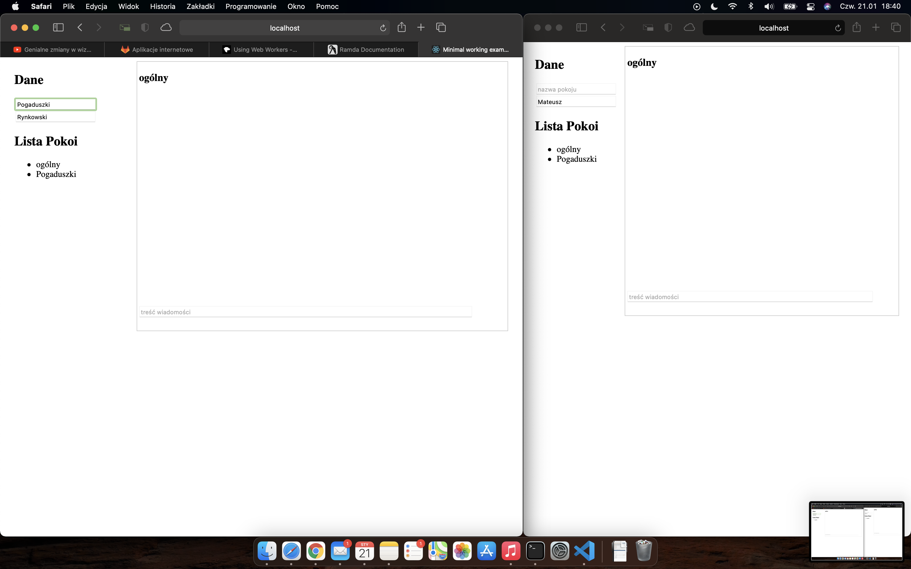

# ai-185icb-ai-lab8
## chat z użyciem protokołu websocket oraz webworkery

Opisy są w tytułach zdjęć - należy najeżdżać na zdjęcia po kolei. W rzeczywistej produkcji, tego typu czaty powinny korzystać z techniki wirtualizacji (przechowywania w drzewie DOM jedynie widocznych wiadomości), aby zwiększyć wydajność, jednak nie o to chodziło w tym ćwiczeniu. 

 działa skrypt (webworker), który mierzy czas na stronie i dokonuje pewnych skomplikowanych obliczeń, aby pobrać wynik skryptu należy kliknąć PPM w dowolnym miejscu na stronie")